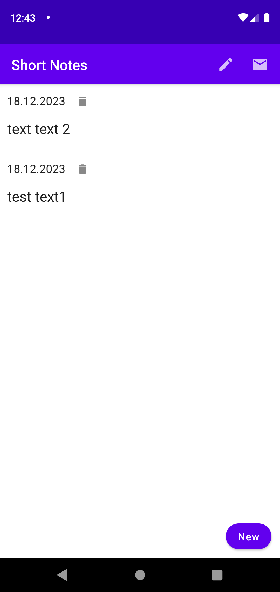

# Приложение "Короткие заметки"

## Описание функционала
Приложение позволяет сохранять небольшие заметки. На основном экране пользователя отображается список всех заметок, а также есть возможность их добавления и удаления. В приложении реализована отправка всех заметок на заданный Email, а также в другие приложения как текст.

## Техническое описание
Приложение написано на языке Kotlin. Для UI используется фреймворк Jetpack Compose.
Приложение построено в соответствии с паттерном MVVM. Для операций с БД используется Room,
Hilt для внедрения зависимостей.
